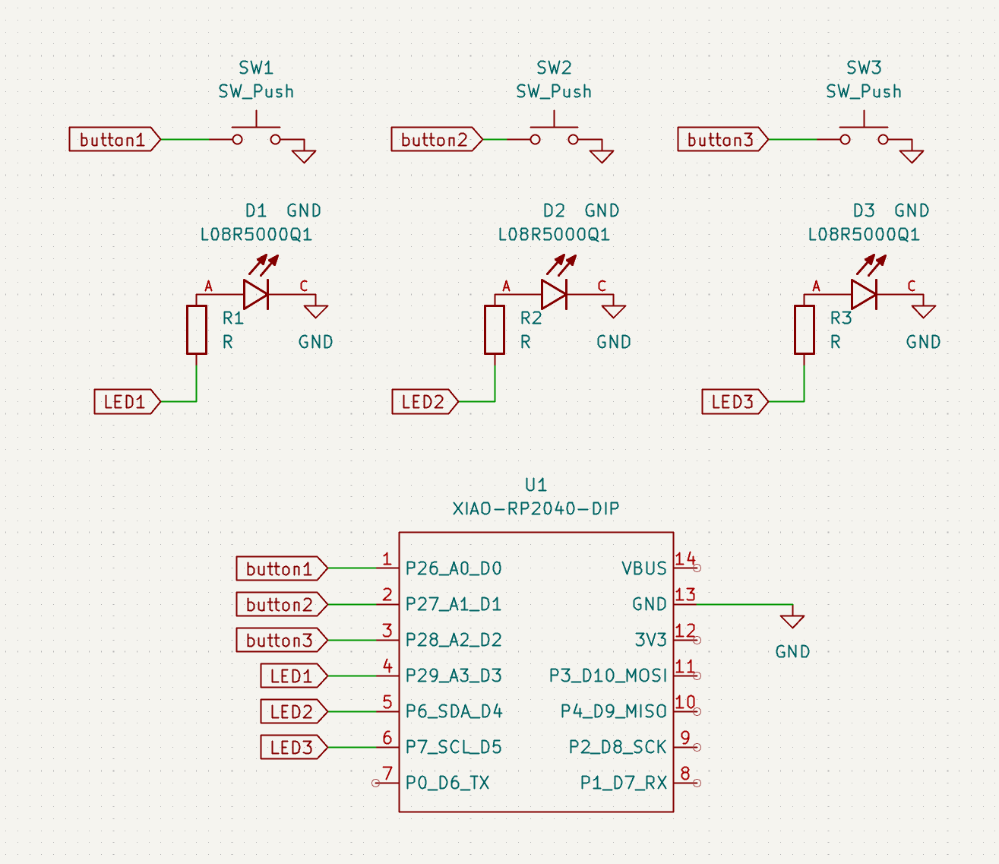
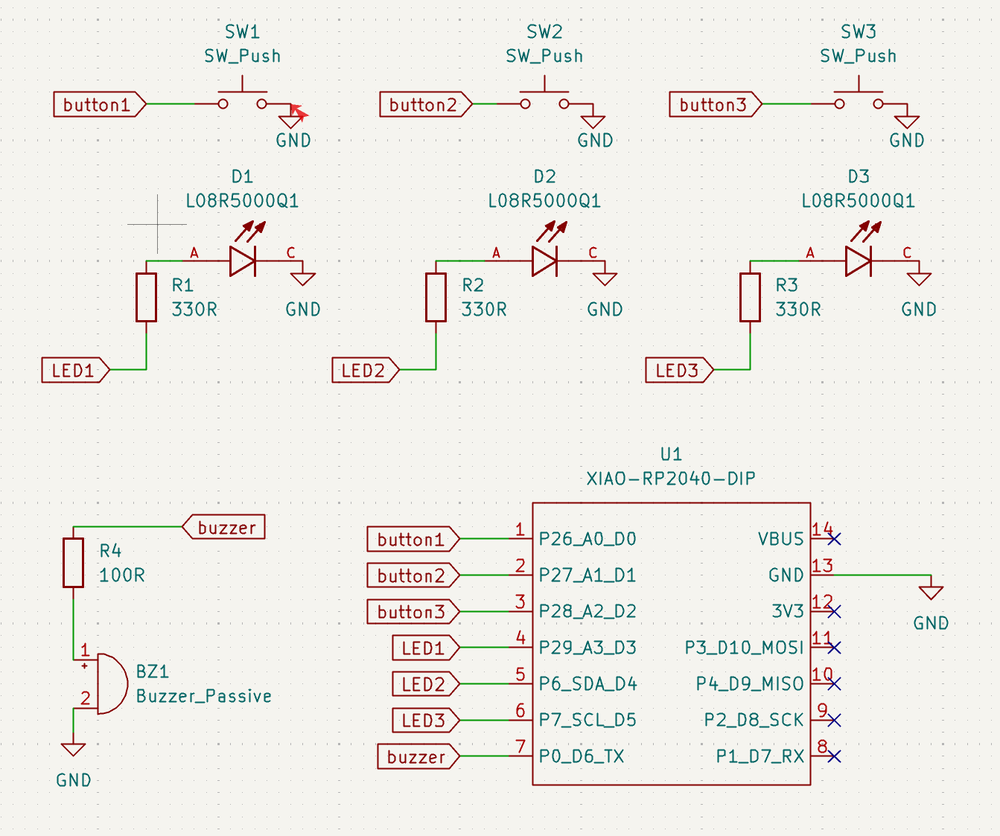
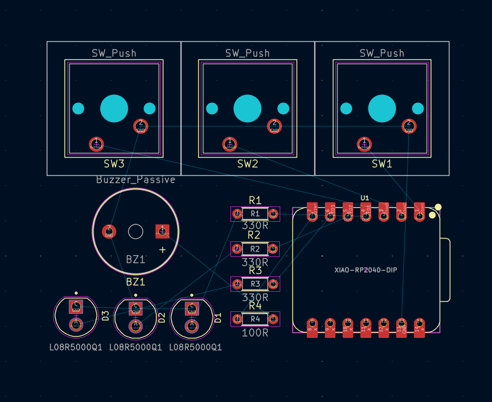
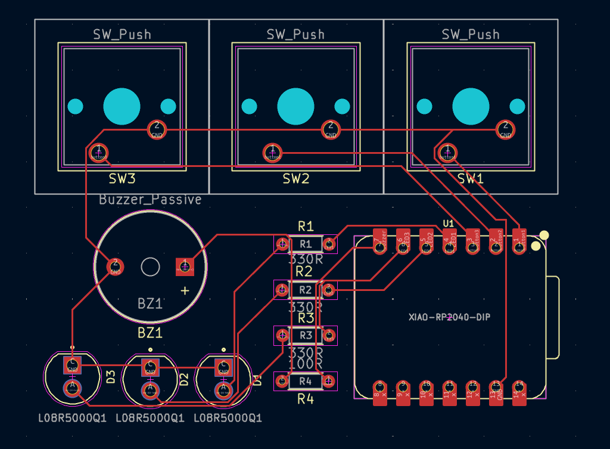
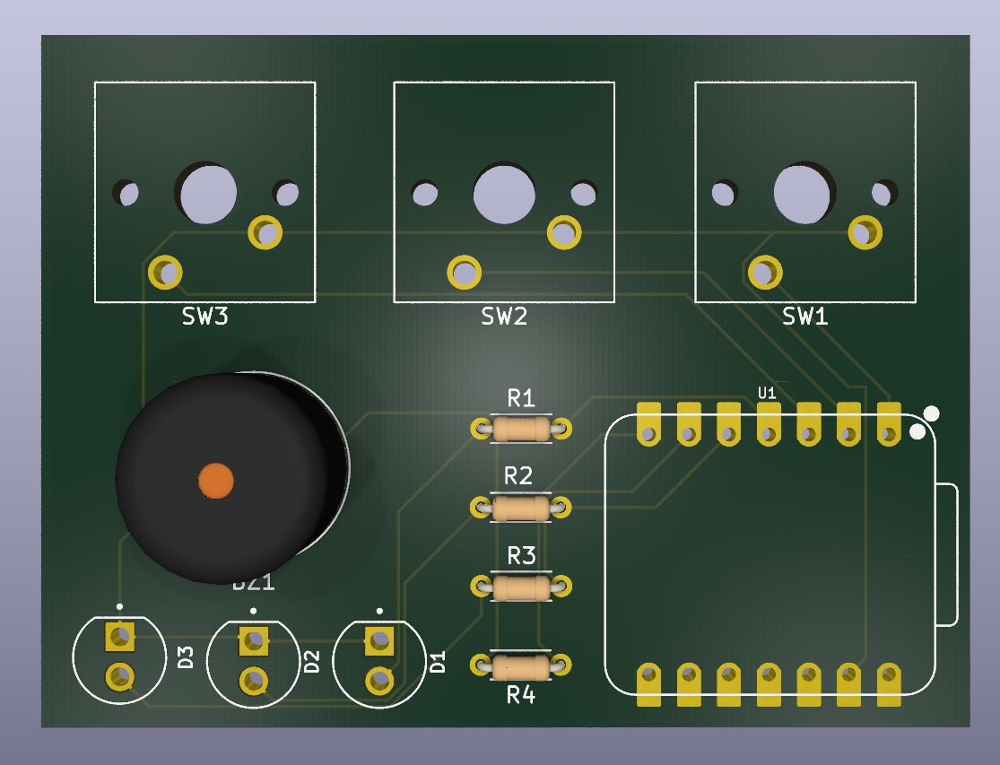
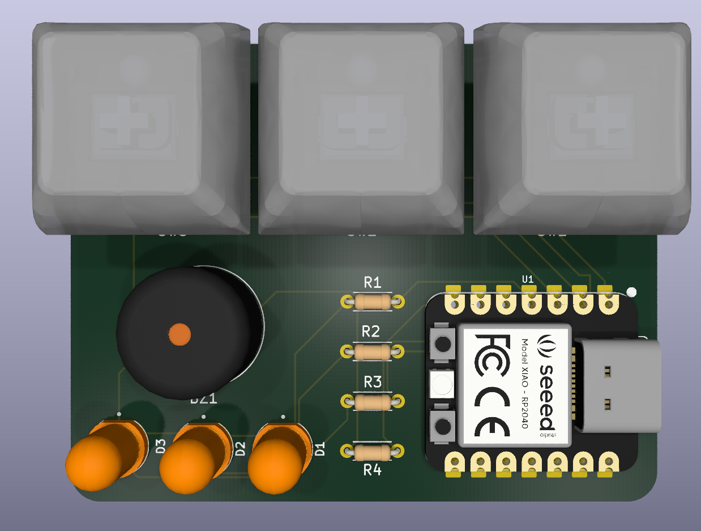
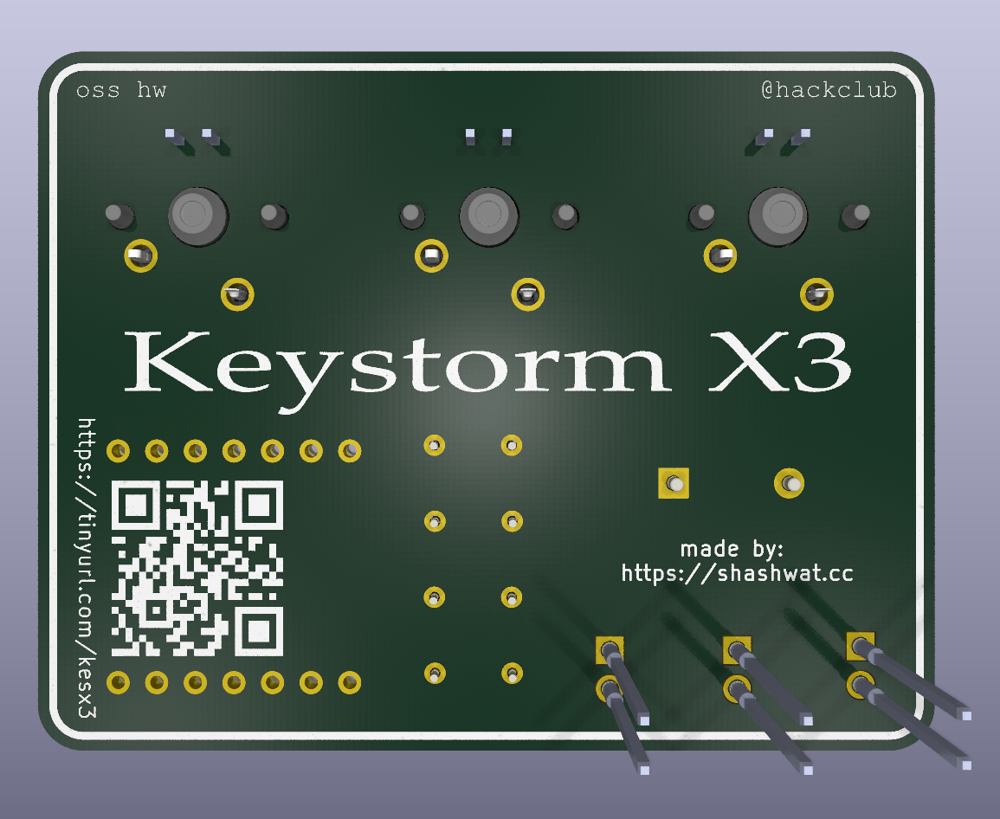
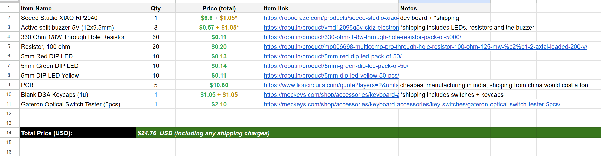

### May 23rd, 2026: basic setup & designing schematics

**02:10 AM**
I started with my project. im yet to decide what. but im gonna follow the opensauce guide and walk through it for my project setup. Once done, im gonna make a simple hardware project by following one of stasis/blueprint guides. The plan is, once i make something simple, i want to dedicate myself to building something really complicated. I'm excited wohoooo!!

**02:20 AM** 
Took me a bit too long to setup everything, but I have created the base files, pushed the repo online and I dumped my previous journal notes into this journal md file. 

**2:34 AM**
Holy moly, I spent a lot of time trying to find ideas about what i can build. i did come across some really good guides about things like spotify display board, hackpad, flight controller etc but eventually ended up deciding on this custom PCB Pathfinder guide by Meghna (https://stasis.hackclub.com/starter-projects/pathfinder/index.html) I'm now gonnna follow this guide and build this for my very first project. this seems interesting & is simple enough since I have zero hardware background

**2:42 AM**
downloaded KiCad, downloaded kicad-wakatime, setup KiCad & created a new projects, connected kicad-wakatime with that project. starting w the schematics now yay

**2:48 AM**
the guide is pretty interesting. im gonna use [this](https://github.com/Seeed-Studio/OPL_Kicad_Library/blob/master/Seeed%20Studio%20XIAO%20Series%20Library/Seeed_Studio_XIAO_Series.kicad_sym) board as the microcontroller/brain for my thing. Ok. i was trying to download that and use it in KiCad but apparently my KiCad is outdated🫩 gonna install the latest kicad now.

**3:10 AM**
okay, latest kicad installed. I setup everything again. was finally able to load and import the symbol i was having issues with last time. I placed it on the schematic editor, and also added some buttons and a custom LED. any custom components are present in the `./libraries/` folder.

**3:20 AM**
wow! i learned about wiring, and global tags. its pretty fun. i also learned some keyboard shortcuts which makes doing anything much easier. im now gonna wire everything up.

**3:33 AM**
wohoooo did some basic wiring and its really fun. i ended up with this schematic desigin after everything was done. and as per the guide, i am done with this part of making the pathfinder. 

next, we need to start designing the PCB & maybe do some changes?

> **total time spent: ~2 hours**

---

### May 24rd, 2026: adding a buzzer & designing the PCB

**17:01 PM**
I don't want my pcb to feel generic. to add a sense of uniqueness, I decided to keep it simple but add some more new components. one of those components is a buzzer. I decided to use a passive buzzer so i can have it play different unique sounds. I found a ton of buzzer footprints from this kicad webpage https://kicad.github.io/footprints/Buzzer_Beeper.html and ended up going with Buzzer_12x9.5RM7.6 (Generic Buzzer, D12mm height 9.5mm with RM7.6mm) since it was the best one for my use case.. only has two pins and is simple enough to wire up

**17:14 PM**
I also added proper resistor values to all the resistors, wired up the buzzer, and fixed some errors & warnings for unused pins. this is how the final schematic design turned out to be: 

**17:55 PM**
i mapped all the footprints & downloaded all the 3d models that i would need to prepare the design. all of these files can be found in /library/3d_models folder

**18:30 PM**
finalized the layout of my pcb and organized all the components accordingly. next step would be to wire up the pcb following those blue lines

**18:45 PM**
i wired everything up. i later realized this is a very bad wiring and learned about layers later during the tutorial. but tbh, nothing is intersecting and the circuit should work without any issues. im gonna let this be for now. but for future projects I'll use multiple layers to have a cleaner wiring

**20:20 PM**
I spent way too long on this than I should have, however I was able to figure out how to assign a 3d model to button footprint. I also added the model for devboard & the LED lights

**23:10 PM**
removed all the component labels, and instead did some designs for silkscreen. the front of silkscreen has some shapes and the back of silkboard has some text stuff written on it. 

> **total time spent: ~6 hours**

---

### May 25th, 2026: coding the firmware & final steps

**00:42 AM**
installed arduino IDE, studied docs for some time. For my use case, we need to make sure that if we plug this device in a computer, it should actually be able to act as a macropad and pass key inputs. since i dont have the board ready with my physically, I am gonna make it act as a basic keyboard + also utilize buzzer and the LED lights while pressing. 

I'm gonna use the keyboard library to make this work. the firmware has the following features:
- plays a nice startup animation when it boots up (LEDs & buzzer)
- has a copy, paste & enter key button
- whenever you press a button, it plays a custom buzzer sound for each and the respective LED also lights up based on what button you pressed

this is a very basic script i wrote. eventually the idea is to allow custom modes on it maybe design a software and even make a pcb case because why not. 

**01:05 AM**
done w scripting

**03:50 AM**
I underestimated how long it would take me to find all the parts & materials. spent a total of 3 hours just searching for the right resistors + a good pcb printing vendor. eventually figured everything out and here is the BOM that i prepared: https://docs.google.com/spreadsheets/d/1Z7pQt6PCEZvinR357QXdnwnkV8Bckr60LjoRv5xW0wc/edit?usp=sharing

> **total time spent: ~3.5 hours**

---
### July 9th, 2026: assembling my macropad

**2:20 PM:** 
I got my macropad PCB delivered to me yesterday evening, but finally it's here. I pretty much have every single part that I need except the pcb which was missing, i also got myself a proper soldering iron, stand, flux, solder wire etc.. 

It took me quite some time to figure out how soldering is supposed to work, was able to install the resistors in and not so long after, I was pretty much done with my build. I had soldered every single component, all well organized, well soldered.

I also spent some time trying to understand how arduino firmware script works and eventually wrote a firmware which allows me to basically beep the macropad and light up the respective LED
![[Pasted image 20260710035835.png]]
NOW NOW NOW AS SOON AS I WAS DONE

the problem is, i soldered the LEDs wrong. the polarity is reversed and they wont work at all. i bent the pins and everything so i cant really remove the LEDs. i dont even have any pliers or such.. I decided to accept my fate and just go with it. I played around, tried really hard to find a workaround but unfortunately nothing really worked as well

> **total time spent: 2.5 hours***

---

### July 10th, 2026: another attempt?

**04:02 AM**:
hey! it's my birthday today. we wrapped up the celebration and now I had nothing else to do. decided to get back to my project. I realised that I could just connect another LED, bend it to face upwards and then solder it on the same pin and things would eventually work. plucking out the old LED wasn't working but its fine. we dont need to remove it. just add another LED which works. 

AND SURPRISINGLY, this was a pretty good idea. i started soldering thigs and this is how it is:
![[soldered_board_back.jpeg]]
If you notice the wires on bottom, how they're bent and everything and facing upwards.. those are LEDs, the new ones that I just added... it works!! :D

![[final_front_keystorm_image.jpeg]]
the board also lights up, everything looks good!!!

I had one problem tho, the red led for some reason is not working. It makes a beep sound on the buzzer that means that connection is working but for some reason the actual LED, it just does not work??? I tested out multiple times, used up like 3-4 LEDs soldered jumper wires in there but no success. the thing is, at the very first, it was the RED led that i soldered first. but then that stopped working and i removed it and swapped the LED and did this like 2-3 times and none of the times it worked so I just decided to keep it away.

the good thing is, connection works, I can hear the buzzer and thats all what matters. the other two switches work with their respective LEDs and thats awesome. here's a video i made, it demonstrates me using the board to play buzzer sounds and LEDs:
![[video.mp4]]

> **total time spent: 1.5hrs***

---
