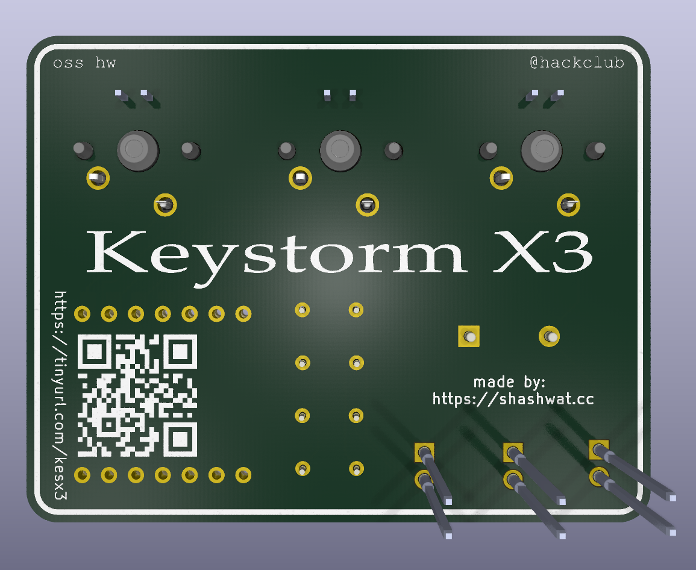
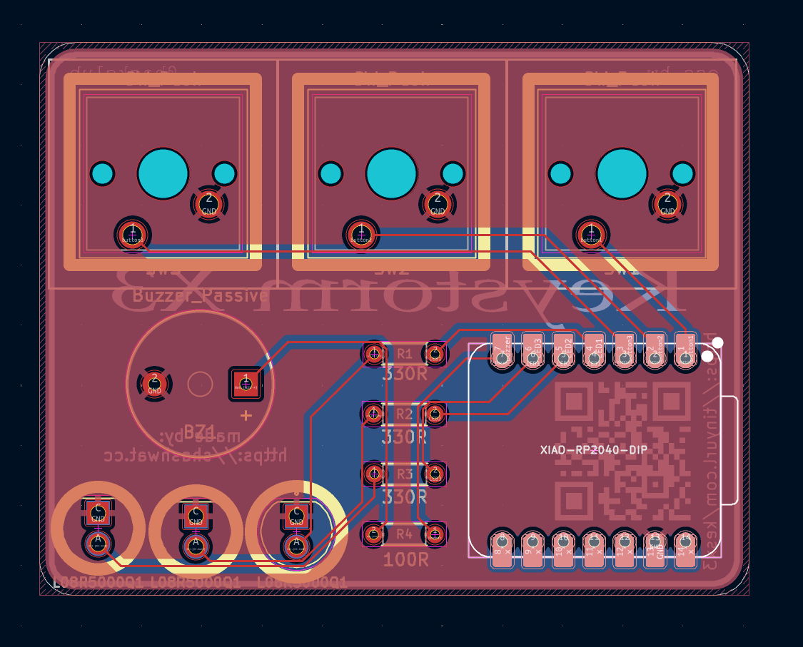
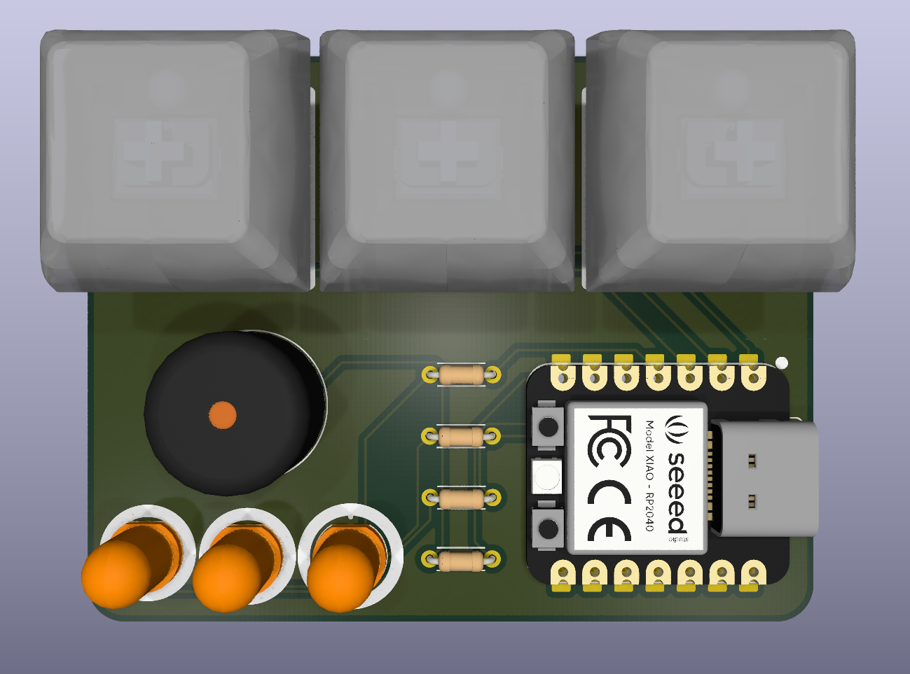
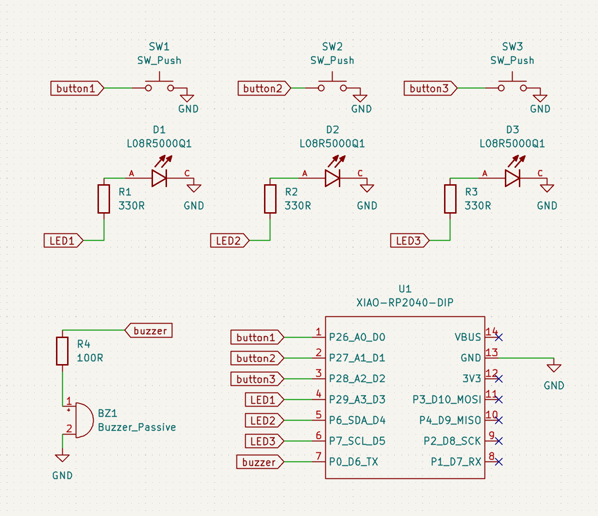

## Keystorm X3

A controller board with 3 LEDs, 3 Cherry MX Switches, and a Buzzer that can be used as a macropad. images below display the board 3d renders, pcb design & the schematic design

The core idea of this macropad is to allow mode switching by long pressing the 3 buttons. This macropad can either be used as a copy paste enter shortcut, your music player control, or your discord voice chat mute/unmute/deafen controller. The buzzer helps with sound feedback so you know when a button is pressed or an action happens. It has a nice startup animation with lights + buzzers which plays when the board boots up.

The BOM can be found [here](https://docs.google.com/spreadsheets/d/1Z7pQt6PCEZvinR357QXdnwnkV8Bckr60LjoRv5xW0wc/edit?usp=sharing)

